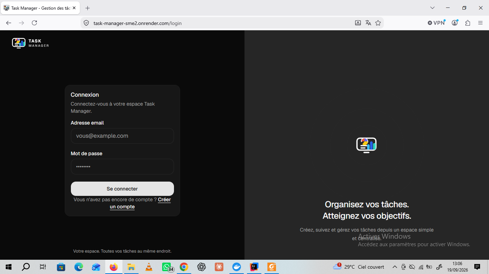
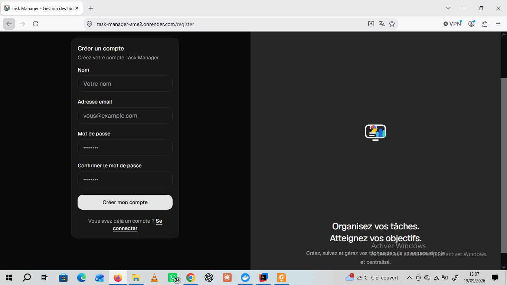
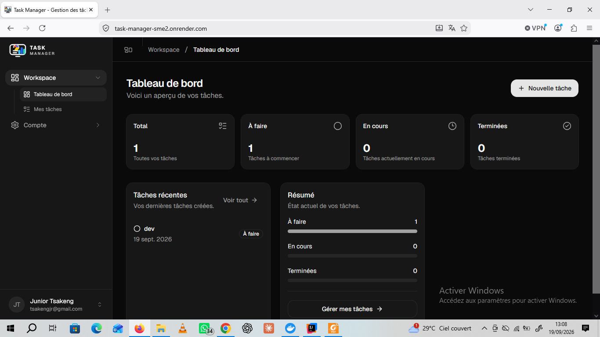
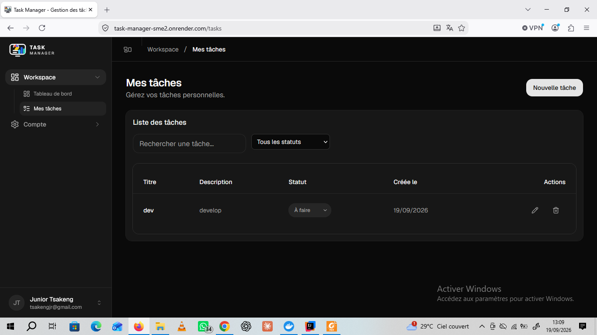
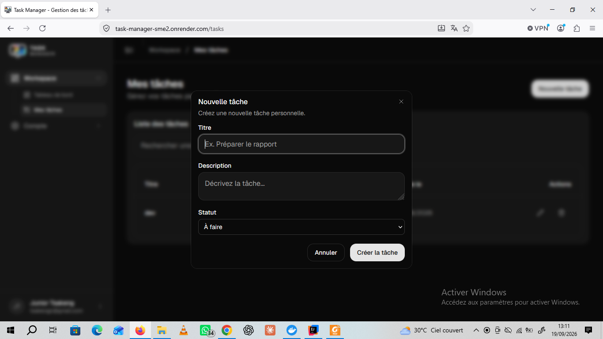

# Task Manager

Application full-stack de gestion de tâches développée avec **Spring Boot, React, TypeScript, Flutter, MySQL et Docker**.

## 🚀 Application déployée

**Application web :**
https://task-manager-sme2.onrender.com

**Repository GitHub :**
https://github.com/thekrakens007/task-manager

> Le backend est déployé sur Render et la base de données MySQL utilise Aiven.

## ✨ Fonctionnalités

### 🔐 Authentification

* Inscription
* Connexion avec JWT
* Déconnexion
* Gestion des sessions
* Protection des routes
* Gestion des erreurs d'authentification

### 📋 Gestion des tâches

* Création de tâches
* Modification de tâches
* Suppression de tâches
* Changement de statut
* Recherche de tâches
* Filtrage par statut
* Dashboard avec statistiques
* Isolation des tâches par utilisateur

### 📱 Application mobile

Une application mobile **Flutter** utilise la même API REST que l'application web.

Elle permet notamment :

* Inscription
* Connexion
* Authentification JWT
* Consultation des tâches
* Création de tâches
* Modification de tâches
* Suppression de tâches
* Recherche et filtrage
* Synchronisation avec l'application web via l'API REST

### ⚙️ Infrastructure

* API REST sécurisée
* Docker / Docker Compose
* CI avec GitHub Actions
* Déploiement du backend sur Render
* Base de données MySQL sur Aiven

## 🛠️ Technologies

### Backend

* Java 21
* Spring Boot 3.5.5
* Spring Security
* Spring Data JPA
* JWT
* Maven
* MySQL

### Frontend Web

* React
* TypeScript
* Vite
* Tailwind CSS
* React Router
* TanStack React Query
* Vitest

### Application mobile

* Flutter
* Dart
* Dio
* SharedPreferences

### Infrastructure

* Docker
* Docker Compose
* Nginx
* GitHub Actions
* Render
* Aiven MySQL

## 🏗️ Architecture

```text
                         ┌─────────────────────┐
                         │   Application Web   │
                         │  React + TypeScript │
                         └──────────┬──────────┘
                                    │
                                    │ REST / JWT
                                    │
                         ┌──────────▼──────────┐
                         │                     │
                         │   Spring Boot API   │
                         │  Spring Security    │
                         │       + JWT         │
                         │                     │
                         └──────────┬──────────┘
                                    │
                                    │ JPA
                                    │
                         ┌──────────▼──────────┐
                         │       MySQL         │
                         │       Aiven         │
                         └──────────▲──────────┘
                                    │
                                    │
                         ┌──────────┴──────────┐
                         │                     │
                         │ Application Mobile  │
                         │      Flutter        │
                         │       + Dio         │
                         │                     │
                         └─────────────────────┘
```

## 📸 Captures d'écran

### 🔐 Connexion Web



### 📝 Inscription Web



### 📊 Dashboard Web



### 📋 Gestion des tâches Web

La liste des tâches permet de rechercher et filtrer les tâches par statut.



### ➕ Création d'une tâche Web



## 📱 Captures de l'application mobile

### 🔐 Connexion Flutter


### 📝 Inscription Flutter


### 📊 Dashboard Flutter


## 📋 Prérequis

Pour exécuter le projet localement :

* Java 21
* Maven
* Node.js 22+
* npm
* Flutter
* Dart
* Docker Desktop

Pour vérifier Flutter :

```bash
flutter --version
```

## 📦 Installation

### 1. Cloner le projet

```bash
git clone https://github.com/thekrakens007/task-manager.git
cd task-manager
```

### 2. Lancer le projet avec Docker

Depuis la racine du projet :

```bash
docker compose up --build
```

Les services suivants seront démarrés :

* MySQL
* Backend Spring Boot
* Frontend React avec Nginx

### Application web

```text
http://localhost:5173
```

### API

```text
http://localhost:8080
```

### 3. Lancer le backend sans Docker

```bash
cd backend
mvn spring-boot:run
```

Le backend sera accessible sur :

```text
http://localhost:8080
```

### 4. Lancer le frontend sans Docker

```bash
cd frontend
npm install
npm run dev
```

Le frontend sera accessible sur :

```text
http://localhost:5173
```

### 5. Lancer l'application Flutter

Depuis la racine du projet :

```bash
cd mobile
flutter pub get
flutter run
```

Pour lancer l'application Flutter dans Chrome :

```bash
flutter run -d chrome
```

> L'application Flutter utilise la même API backend que l'application web.

## 🧪 Tests

### Tests frontend

```bash
cd frontend
npm run test
```

### Analyse Flutter

```bash
cd mobile
flutter analyze
```

### CI

GitHub Actions exécute automatiquement :

* les tests backend
* le build backend
* les tests frontend
* le build frontend

## 🔐 API

### Authentification

```text
POST /api/auth/register
POST /api/auth/login
```

### Tâches

```text
GET    /api/tasks
POST   /api/tasks
PUT    /api/tasks/{id}
DELETE /api/tasks/{id}
```

Les endpoints de gestion des tâches nécessitent un token JWT valide.

### Flux d'authentification

```text
1. Inscription
       ↓
2. Connexion
       ↓
3. Réception du JWT
       ↓
4. JWT envoyé dans Authorization
       ↓
5. Accès aux tâches
```

## 🔒 Sécurité

L'application utilise **Spring Security et JWT** pour sécuriser l'API.

Les mots de passe sont protégés avec **BCrypt**.

Chaque tâche est associée à son utilisateur propriétaire.

Un utilisateur ne peut donc accéder qu'à ses propres tâches.

Les endpoints protégés nécessitent un token JWT valide.

## 🐳 Docker

Le projet fournit un environnement Docker Compose comprenant :

* MySQL
* Backend Spring Boot
* Frontend React
* Nginx

Pour démarrer l'ensemble :

```bash
docker compose up --build
```

Pour arrêter les conteneurs :

```bash
docker compose down
```

Pour arrêter les conteneurs et supprimer les volumes :

```bash
docker compose down -v
```

## 🔄 Synchronisation Web / Mobile

Les applications Web et Mobile utilisent la même API REST.

```text
                 ┌─────────────────┐
                 │    React Web    │
                 └────────┬────────┘
                          │
                          │ REST / JWT
                          │
                          ▼
                 ┌─────────────────┐
                 │  Spring Boot    │
                 │    REST API     │
                 └────────┬────────┘
                          │
                          │ JPA
                          ▼
                 ┌─────────────────┐
                 │      MySQL      │
                 │     Aiven       │
                 └─────────────────┘
                          ▲
                          │
                          │ REST / JWT
                          │
                 ┌────────┴────────┐
                 │ Flutter Mobile  │
                 └─────────────────┘
```

Les deux applications utilisent les mêmes données via l'API backend.

Une tâche créée depuis l'application web peut être récupérée depuis l'application mobile, et inversement.

## ☁️ Déploiement

### Backend

Le backend Spring Boot est déployé sur **Render**.

### Frontend

Le frontend React est déployé sur **Render**.

### Base de données

La base de données de production utilise **MySQL sur Aiven**.

### Application mobile

L'application Flutter utilise la même API REST que l'application web.

Elle peut être exécutée localement ou compilée pour une plateforme compatible Flutter.

## 📁 Structure du projet

```text
task-manager/
│
├── backend/
│   ├── src/
│   ├── pom.xml
│   └── Dockerfile
│
├── frontend/
│   ├── src/
│   ├── package.json
│   └── Dockerfile
│
├── mobile/
│   ├── lib/
│   │   ├── models/
│   │   ├── screens/
│   │   ├── services/
│   │   └── widgets/
│   ├── pubspec.yaml
│   └── test/
│
├── docs/
│   └── screenshots/
│       ├── img.png
│       ├── img_1.png
│       ├── img_4.png
│       ├── img_5.png
│       └── img_6.png
│
├── .github/
│   └── workflows/
│       └── ci.yml
│
├── docker-compose.yml
├── .gitignore
└── README.md
```

## 👨‍💻 Auteur

**Junior Tsakeng**

GitHub :
https://github.com/thekrakens007
