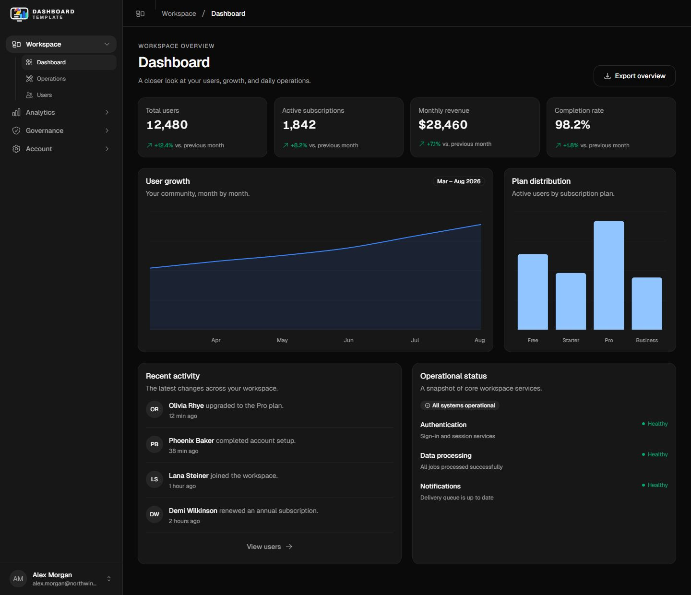
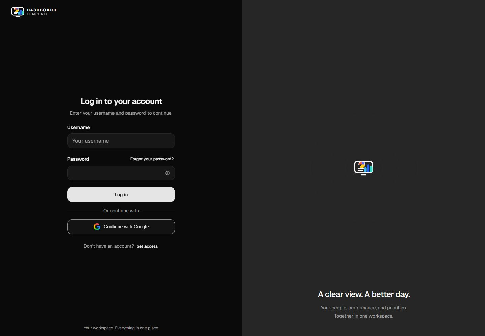
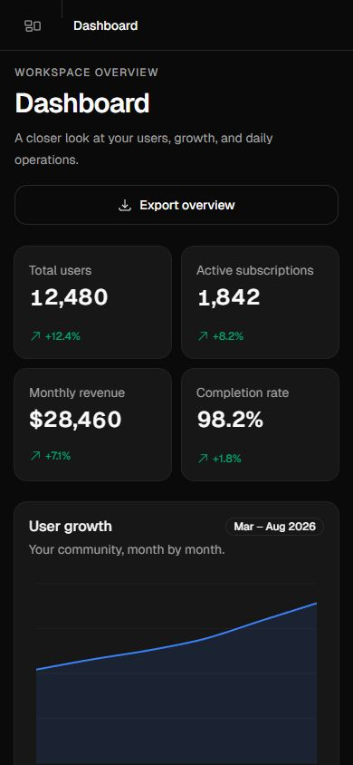
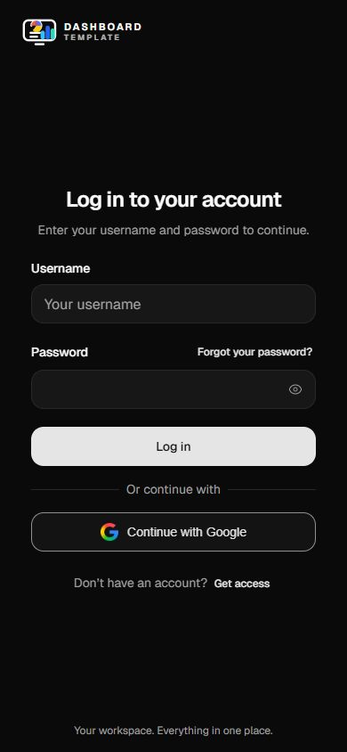

# Dashboard Template

[](https://github.com/youssefsz/dashboard-template-react-vite/actions/workflows/ci.yml)
[](https://react.dev)
[](./tsconfig.app.json)
[](https://bun.sh)
[](./LICENSE)

A React and Vite dashboard template with beui interactions, a collapsible sidebar, and dedicated mobile layouts. Start with analytics, operations, user management, and governance screens, then connect your own data.

[Get started](#get-started) · [Screenshots](#screenshots) · [Contribute](./CONTRIBUTING.md) · [Report a bug](https://github.com/youssefsz/dashboard-template-react-vite/issues/new?template=bug_report.yml)



## Get started

Install [Bun](https://bun.sh), then clone the repository. The version used for development and CI is recorded in [.bun-version](./.bun-version).

```bash
git clone https://github.com/youssefsz/dashboard-template-react-vite.git
cd dashboard-template-react-vite
bun install --frozen-lockfile
bun run dev
```

Open the local URL printed by Vite. Enter any nonempty username and password, or choose **Continue with Google**. No environment variables or OAuth credentials are required.

Both login options create a local demo session. They do not verify passwords or authenticate with Google. The session and workspace settings persist in this browser; passwords are never saved. Use sample data until you add server-validated authentication and permissions. See [SECURITY.md](./SECURITY.md).

## What's included

| Screen           | Behavior                                                                                                    |
| ---------------- | ----------------------------------------------------------------------------------------------------------- |
| Login            | Username and password fields, browser autofill, and mock Google access                                      |
| Dashboard        | Summary metrics, charts, recent activity, and CSV export                                                    |
| Analytics        | User growth, onboarding, subscriptions, processing, and engagement reports with period selection and export |
| Operations       | Search background jobs, inspect queue status, and retry a failed job                                        |
| Users            | Search accounts, inspect details, and export filtered results                                               |
| Administrators   | Review access and prepare invitations with validation and duplicate checks                                  |
| Roles            | Inspect the permission catalog for owners, administrators, and analysts                                     |
| Audit log        | Search administrative events, view details, and export records                                              |
| Deletion records | Review closure requests and retention history without deleting accounts                                     |
| Account          | Workspace settings with local saving, plus a session list with confirmation before removal                  |

The sidebar remembers its desktop state and opens as a drawer on phones. User tables become stacked records on smaller screens. Shared controls use beui motion components, with Base UI for menus and dialogs. Motion respects the device's reduced-motion preference.

The [route guide](./docs/routes.md) lists every page and its demo interactions. All account and dashboard data is illustrative. Invitations, job retries, and device-list changes stay in the current page state and reset when you leave it. They do not send email, run background jobs, or revoke real sessions.

## Screenshots

The desktop dashboard uses a 1440 × 1240 viewport; the login uses 1440 × 1000. Phone captures use 390 × 844 and show the first screen, with the dashboard continuing below it.

<details>
<summary>Desktop login</summary>



</details>

|                                                             Mobile dashboard                                                             |                                                     Mobile login                                                      |
| :--------------------------------------------------------------------------------------------------------------------------------------: | :-------------------------------------------------------------------------------------------------------------------: |
|  |  |

The [screenshot guide](./docs/screenshots/README.md) explains how to refresh these images.

## Development

| Command             | Purpose                                                  |
| ------------------- | -------------------------------------------------------- |
| `bun run dev`       | Start Vite with hot reload                               |
| `bun run check`     | Run type checking, lint, tests, and the production build |
| `bun run typecheck` | Check the app, tests, and Vite configuration             |
| `bun run lint`      | Run ESLint with zero warnings allowed                    |
| `bun run test`      | Run the behavioral tests                                 |
| `bun run build`     | Type check and write the production bundle to `dist/`    |
| `bun run preview`   | Serve the local production build                         |
| `bun run format`    | Format TypeScript and TSX files                          |

GitHub Actions runs the same `check` command on pull requests and pushes to `main`. Actions are pinned to commit hashes.

The stack is React 19, TypeScript, Vite, Bun, Tailwind CSS v4, beui, Motion, Base UI, React Router, TanStack Query, React Hook Form, Zod, and Recharts.

## Adapt the template

```text
src/
  app/          Providers and route configuration
  components/   Shared UI and local beui components
  features/     Auth, analytics, operations, governance, and accounts
  layouts/      Login shell, app shell, and sidebar
  lib/          Shared utilities and motion settings
  pages/        Route entry points
  styles/       Theme tokens and global styles
tests/          Behavioral tests
```

Start with the page you want to change in `src/features`. Keep common input and button behavior in `src/components`, and adjust colors through `src/styles/globals.css`. Replace the mock service in `src/features/auth/services/auth-service.ts` when adding real authentication.

For static hosting, configure the host to serve `index.html` for client routes such as `/users`. `bun run preview` is for local verification, not a production server.

## Contribute

Read [CONTRIBUTING.md](./CONTRIBUTING.md) for setup, checks, and the pull request process. [AGENTS.md](./AGENTS.md) records the implementation and design rules. Use the [issue forms](https://github.com/youssefsz/dashboard-template-react-vite/issues/new/choose) for bugs and feature proposals.

Follow the [code of conduct](./CODE_OF_CONDUCT.md). Report vulnerabilities privately using [SECURITY.md](./SECURITY.md).

## License and credits

Created by [Youssef Dhibi](https://youssef.tn). Available under the [MIT license](./LICENSE).

Local motion components are adapted from [beui](https://beui.dev). The sidebar integration follows the [VeloCare admin dashboard](https://github.com/youssefsz/velocare-admin-dashboard). See [third-party notices](./THIRD_PARTY_NOTICES.md) for attribution and Google brand asset terms.
